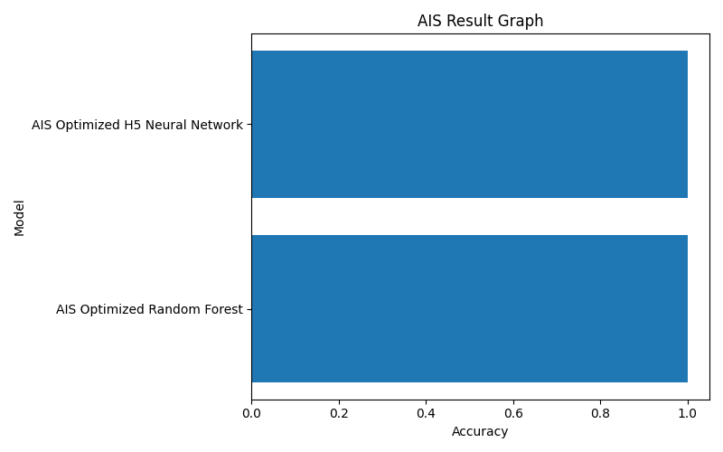

# 🚚 Agricultural Trade Route Optimization System

## 🧠 Trade Route Priority Prediction using Machine Learning & Bio-Inspired Optimization

---

## 👤 Author

**Sagnik Patra**

---

## 📌 Project Overview

This project builds an end-to-end **Agricultural Trade Route Optimization System** using Machine Learning and Bio-Inspired Optimization Algorithms.

The system analyzes agricultural market datasets from Meghalaya, performs feature engineering, applies optimization-based feature selection, and predicts agricultural trade route priority levels using optimized machine learning models.

The project automatically generates:

- Prediction CSV files
- Result CSV files
- H5 model files
- PKL model files
- YAML configuration files
- JSON result files
- Accuracy reports
- Visualization graphs
- Heatmaps
- Optimization progress graphs

---



---

## 🎯 Objectives

- Analyze agricultural market distribution patterns
- Predict trade route priority levels using machine learning
- Perform feature engineering on market network data
- Optimize feature selection using bio-inspired algorithms
- Generate prediction and result reports
- Save trained models and configuration files
- Visualize model performance and optimization progress

---

## ⚙️ Tech Stack

- Python
- Pandas
- NumPy
- Scikit-learn
- TensorFlow / Keras
- Matplotlib
- Joblib
- YAML
- JSON

---

## 🧬 Optimization Algorithms Used

- AIS – Artificial Immune System
- CSA – Clonal Selection Algorithm
- PSO – Particle Swarm Optimization
- QPSO – Quantum Particle Swarm Optimization
- BA – Bat Algorithm
- HSA – Harmony Search Algorithm
- GA – Genetic Algorithm

---

## 📂 Dataset

```text
megambmarketname_n.xls
```

Dataset Fields:

- District Name
- Block Name
- Market Name

The dataset contains agricultural market information across Meghalaya districts and blocks.

---

## 🏗️ System Workflow

### Step 1: Data Collection

- Load Meghalaya agricultural market dataset
- Validate records
- Remove duplicate entries
- Handle missing values

### Step 2: Data Preprocessing

- Label Encoding
- Data Cleaning
- Standard Scaling
- Feature Transformation

### Step 3: Feature Engineering

Generated features include:

- District Market Count
- Block Market Count
- Market Name Length
- Block Name Length
- District Name Length
- Route Density Score

### Step 4: Feature Selection

Bio-inspired optimization algorithms select the most informative features:

- AIS
- CSA
- PSO
- QPSO
- BA
- HSA
- GA

### Step 5: Model Training

Machine Learning Models:

- Random Forest Classifier

Deep Learning Models:

- TensorFlow/Keras Neural Network

### Step 6: Prediction

Trade Route Priority Categories:

- Low Route Priority
- Medium Route Priority
- High Route Priority

### Step 7: Reporting & Visualization

The system automatically generates:

- Accuracy Graphs
- Prediction Graphs
- Comparison Graphs
- Heatmaps
- Optimization Progress Graphs
- Confusion Matrix Graphs

---

## 📊 Generated Outputs

### CSV Files

```text
ais_result.csv
ais_prediction.csv

csa_result.csv
csa_prediction.csv

pso_result.csv
pso_prediction.csv

qpso_result.csv
qpso_prediction.csv

ba_result.csv
ba_prediction.csv

hsa_result.csv
hsa_prediction.csv
```

---

### Model Files

```text
ais_model.h5
ais_model.pkl

csa_model.h5
csa_model.pkl

pso_model.h5
pso_model.pkl

qpso_model.h5
qpso_model.pkl

ba_model.h5
ba_model.pkl

hsa_model.h5
hsa_model.pkl
```

---

### Configuration Files

```text
ais_config.yaml
ais_results.json

csa_config.yaml
csa_results.json

pso_config.yaml
pso_results.json

qpso_config.yaml
qpso_results.json

ba_config.yaml
ba_results.json

hsa_config.yaml
hsa_results.json
```

---

### Visualization Files

```text
ais_accuracy_graph.png
ais_comparison_graph.png
ais_heatmap.png
ais_result_graph.png
ais_prediction_graph.png
ais_optimization_graph.png

csa_accuracy_graph.png
csa_comparison_graph.png
csa_heatmap.png
csa_result_graph.png
csa_prediction_graph.png
csa_optimization_graph.png

pso_accuracy_graph.png
pso_comparison_graph.png
pso_heatmap.png
pso_result_graph.png
pso_prediction_graph.png
pso_optimization_graph.png

qpso_accuracy_graph.png
qpso_comparison_graph.png
qpso_heatmap.png
qpso_result_graph.png
qpso_prediction_graph.png
qpso_optimization_graph.png

ba_accuracy_graph.png
ba_comparison_graph.png
ba_heatmap.png
ba_result_graph.png
ba_prediction_graph.png
ba_optimization_graph.png

hsa_accuracy_graph.png
hsa_comparison_graph.png
hsa_heatmap.png
hsa_result_graph.png
hsa_prediction_graph.png
hsa_optimization_graph.png
```

---

## 📈 Performance Metrics

The system evaluates models using:

- Accuracy Score
- Precision
- Recall
- F1-Score
- Confusion Matrix
- Feature Selection Fitness Score

---

## 🎯 Applications

- Agricultural Supply Chain Planning
- Trade Route Optimization
- Rural Market Connectivity Analysis
- Agricultural Infrastructure Planning
- Government Market Development Programs
- Farmer Market Accessibility Studies
- Smart Agriculture Analytics

---

## 🚀 Installation

### Clone Repository

```bash
git clone https://github.com/your-repository/agricultural-trade-route-optimization-system.git
```

### Install Dependencies

```bash
pip install pandas
pip install numpy
pip install scikit-learn
pip install tensorflow
pip install matplotlib
pip install pyyaml
pip install xlrd
```

---

## ▶️ Run Project

```bash
python agricultural_trade_route_optimization.py
```

---

## 📁 Project Structure

```text
Agricultural Trade Route Optimization System/
│
├── megambmarketname_n.xls
│
├── ais_result.csv
├── ais_prediction.csv
├── ais_model.h5
├── ais_model.pkl
│
├── csa_result.csv
├── csa_prediction.csv
├── csa_model.h5
├── csa_model.pkl
│
├── pso_result.csv
├── pso_prediction.csv
├── pso_model.h5
├── pso_model.pkl
│
├── qpso_result.csv
├── qpso_prediction.csv
├── qpso_model.h5
├── qpso_model.pkl
│
├── ba_result.csv
├── ba_prediction.csv
├── ba_model.h5
├── ba_model.pkl
│
├── hsa_result.csv
├── hsa_prediction.csv
├── hsa_model.h5
├── hsa_model.pkl
│
├── YAML Files
├── JSON Files
├── Graphs
└── README.md
```

---

## 🔮 Future Enhancements

- Real-Time Agricultural Trade Route Forecasting
- GIS-Based Market Mapping
- Transportation Cost Prediction
- Market Demand Forecasting
- Deep Reinforcement Learning Optimization
- Hybrid Bio-Inspired Optimization Algorithms
- Smart Route Recommendation Dashboard

---

## 📜 License

This project is developed for academic, research, and agricultural analytics purposes.

---

## ⭐ Project Highlights

✅ End-to-End Machine Learning Pipeline  
✅ Bio-Inspired Feature Selection  
✅ Trade Route Priority Prediction  
✅ Deep Learning Integration  
✅ Automated Report Generation  
✅ Interactive Visualizations  
✅ Model Export Support  
✅ Scalable Agricultural Analytics Framework

---
